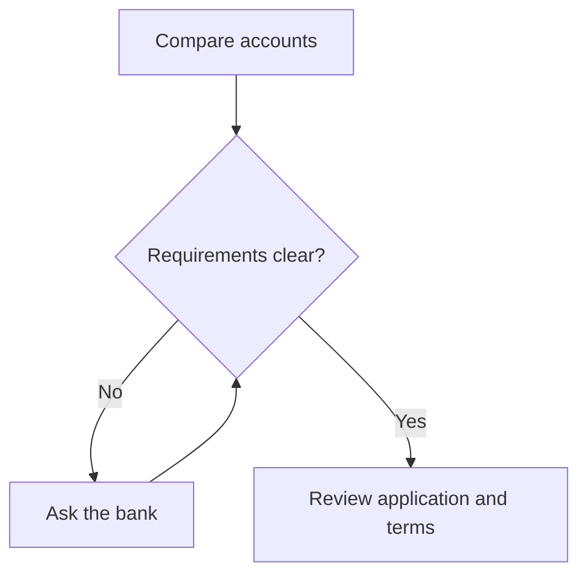

[@layout]: ../layouts/work.layout.md
[@visuals]: ../components/dr-bos.components.md

# Dr.Bos visual vocabulary

These are the same literate components used in saved AI replies. This example
works without an AI request. Edit their definitions in the
[component Source](../components/dr-bos.components) and see the result update.

[Try a live conversation](../dr-boss.page) · [Integration guide](./dr-boss-chat.guide)

---

## A process

Compare the same kinds of costs for each housing option.

<bos-steps>
<slot name="title">Compare housing costs</slot>
<bos-step><slot name="title">Upfront costs</slot>
List what you would need before moving in.
</bos-step>
<bos-step><slot name="title">Monthly costs</slot>
Include recurring costs for each option.
</bos-step>
<bos-step><slot name="title">Room for surprises</slot>
Identify unexpected costs your comparison leaves out.
</bos-step>
</bos-steps>

Which cost have you included, and which still needs checking?

---

## A comparison

Compare the same dimensions without declaring a universal winner.

<bos-compare>
<slot name="title">Two housing options</slot>
<bos-option><slot name="title">Renting</slot>
Examine the lease's flexibility and which costs remain your responsibility.
</bos-option>
<bos-option><slot name="title">Buying</slot>
Examine the costs of changing homes and the ongoing responsibility for maintenance.
</bos-option>
</bos-compare>

How does the person's time horizon change this comparison?

---

## A connected graph

An illustrative process; requirements vary by bank and location.

<bos-flow>
<slot name="title">Opening an account: a planning example</slot>
<bos-node><slot name="title">Compare accounts</slot>
Check fees, access, and the terms that matter to you.
</bos-node>
<bos-node><slot name="title">Check requirements</slot>
Ask the bank which documents and eligibility rules apply.
</bos-node>
<bos-node><slot name="title">Apply and review</slot>
Follow the bank’s application process and review the terms before agreeing.
</bos-node>
</bos-flow>

---

## A branching Mermaid graph

An illustrative process: compare accounts, clarify requirements with the bank if
needed, then review the application and terms. This is not a universal checklist.

---

## Native numeric charts

<bos-chart><slot name="title">Fictional budget shares</slot>
Percent, in order: needs 50, wants 30, savings 20.

{b:50,30,20}
</bos-chart>

Fictional savings progress (percent of a goal), weeks 1–4: 10, 20, 30, 40.

<bos-chart><slot name="title">Fictional weekly progress</slot>
{l:10,20,30,40}

Weeks 1–4: 10, 20, 30, 40 percent.
</bos-chart>

Fictional savings goal: 25 percent complete.

<bos-chart><slot name="title">Fictional savings goal</slot>
{p:25}

25 percent complete.
</bos-chart>

---

## Native math

In a fictional example, saving 200 out of an income of 1,000 is 20 percent:

$$
\frac{200}{1000} \times 100 = 20
$$

Inline notation works too: $200 + 300 = 500$.

---

## Labeled percentage bars

<bos-chart><slot name="title">Fictional budget shares</slot>

Percent of a fictional monthly budget, not a recommended split.

<bos-bar value="50">Needs</bos-bar>
<bos-bar value="30">Wants</bos-bar>
<bos-bar value="20">Savings</bos-bar>
</bos-chart>
